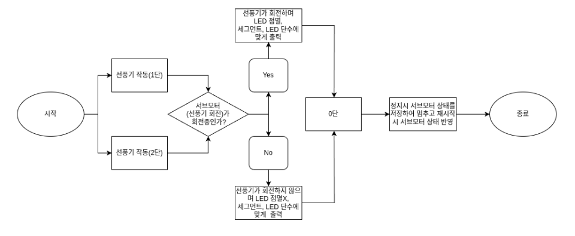

# 🧊 선풍기(Fan) Application – AVR ATmega128A

AVR(ATmega128A) 기반의 선풍기 제어 애플리케이션입니다.  
메인/서브 모터 제어, LED 표시, 버튼 입력을 포함합니다.

파일에 ap.c와 main.c가 없음을 확인 할 수 있는데 두 코드는 다음과 같이 구성하면 됩니다.

ap.c Code

```c

#include "ap.h"

void apMain()
{
    myledInit();
    led8Init();
    mainMotorInit();
    subMotorInit();
    DDRG &= ~((1 << 0) | (1 << 1) | (1 << 2)); // PG포트 0번 1번 2번 버튼
    PORTG |= (1 << 0) | (1 << 1) | (1 << 2);   //
    while (1)
    {
        mainMotorHandler();
        handleSubMotor();
    }
}
```

선풍기 Main.c

```c

#include "src/ap/ap.h"

int main()
{
    
    apInit();
    
    apMain();

    while (1)
    {
    }
}

```

<p align="left">
  <a href="#-프로젝트-개요">개요</a> •
  <a href="#-skill-stack">Skill Stack</a> •
  <a href="#-data-flow">Data Flow</a> •
  <a href="#-기능">기능</a> •
  <a href="#-폴더-구조">폴더 구조</a> •
  <a href="#-기여도">기여도</a> •
  <a href="#-시연-영상">시연 영상</a>
</p>

---

## 📌 프로젝트 개요
- **MCU**: ATmega128A  
- **기능**: 메인/서브 모터 구동, LED 상태 표시, 버튼 입력 처리  
- **언어/툴체인**: C, AVR-GCC(또는 AVR Studio/Atmel Studio), Makefile

---

## 🛠 Skill Stack


---

## 👉 Data Flow



---

## ✨ 기능
- 메인 모터 구동 및 주기적 처리
- 서브 모터 제어 및 핸들러 분리
- 8-LED 상태 표시
- PG0, PG1, PG2 버튼 입력 처리(풀업)

---

## 📁 폴더 구조
```
> Fan_project/
├─ src/
│ ├─ ap/
│ │ ├─ ap.c
│ │ └─ ap.h
│ ├─ drivers/
│ │ ├─ main_motor.c
│ │ ├─ main_motor.h
│ │ ├─ sub_motor.c
│ │ ├─ sub_motor.h
│ │ ├─ led8.c
│ │ └─ led8.h
│ └─ common/
│ └─ def.h
├─ main.c
├─ Makefile
└─ README.md
```

---


## 📊 기여도


- 프로젝트 기획  : ███████████████ 100%
- 코딩         : ███████████████ 100%
- PPT 제작     : ██████████░░░░░ 60%
- 하드웨어 제작  : ██░░░░░░░░░░░░░ 10%

---

## 🎥 시연 영상 (youtube)
[Fan 동작 시연 영상](https://youtube.com/shorts/1hI5zOKwSYM?si=YDrBZZp4fr1kNrV7)

[Fan Button입력 시연](https://youtube.com/shorts/zhNqf4abCzI?si=6mGe7o1zvqryWyl2)


